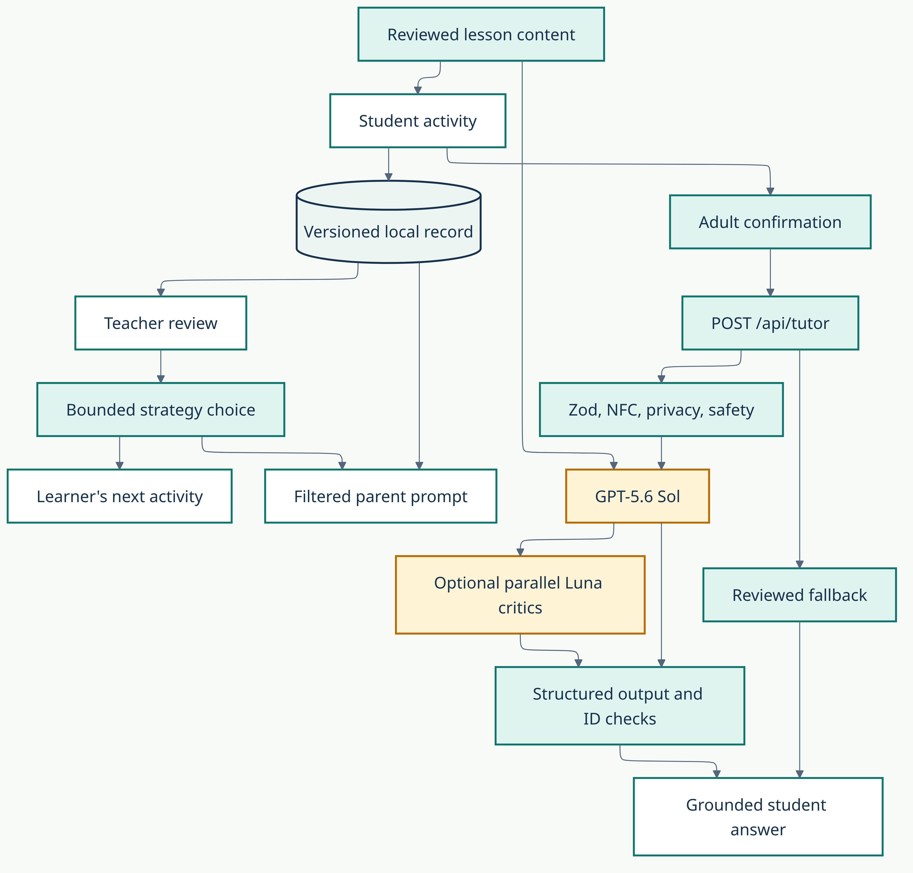

# Kanni | കണ്ണി

Kanni turns one learning moment into age-appropriate help for a Kerala student, a clear signal for their teacher, and one useful next step for their parent.

This repository contains the OpenAI Build Week concept demo. It implements two narrow lesson slices:

- Class 1 Mathematics: addition within 10, Malayalam first, adult assisted, fixed choices
- Class 11 Computer Science: linear search, English first, reviewed questions, and one bounded custom-question field

Classes 2 to 10 and Class 12 are roadmap items. Kanni does not claim full curriculum coverage, statewide readiness, or improved academic performance.

## What works

One local, versioned learning record connects all three views:

```text
Student attempt
    ↓
Reviewed hint or grounded answer
    ↓
Follow-up understanding check
    ↓
Teacher reviews the activity and selects a strategy
    ↓
Parent receives one filtered home activity
    ↓
The learner's next activity uses the teacher-selected strategy
```

The Class 1 demo can record this exact event: the initial answer was incorrect, a hint was used, and the follow-up answer was correct. That is an observation from one synthetic activity. It is not evidence of long-term learning.

## Run locally

Requirements:

- Node.js 24
- pnpm 10.27 or later in the 10.x line

Install and run the static demo:

```bash
pnpm install
pnpm dev
```

Open `http://localhost:3000`.

The reviewed Class 1 activity and Class 11 suggested questions work without an AI key. To test supervised AI, copy `.env.example` to `.env.local` and set:

```text
AI_PRIMARY_MODEL=openai/gpt-5.6-sol
AI_CRITIC_MODEL=openai/gpt-5.6-luna
AI_DEMO_ENABLED=true
AI_GATEWAY_API_KEY=<budgeted Vercel AI Gateway key>
ADULT_GATE_SECRET=<long random server-only secret>
```

Do not expose either secret through a `NEXT_PUBLIC_` variable. Kanni also accepts Vercel's server-provided OIDC token in place of a Gateway API key.

## Verify the repository

Run these commands from the repository root:

```bash
pnpm lint
pnpm typecheck
pnpm test
pnpm eval
pnpm build
pnpm test:e2e
```

`pnpm test:e2e` starts the existing production build on port 3173. Run `pnpm build` first.

Verified locally on July 16, 2026:

| Check | Result |
|---|---:|
| ESLint | Passed |
| TypeScript strict check | Passed |
| Unit and mocked API tests | 55 passed |
| Deterministic eval preflight | 32 of 32 passed |
| Playwright desktop and mobile flows | 10 passed |
| Serious or critical Axe findings in the tested Trust flow | 0 |
| 360-pixel, reflow-equivalent, reduced-motion, and Malayalam language checks | Passed |
| Production build | Passed, 11 route entries |
| Judge-facing screenshots | 7 captured and visually inspected |
| Live GPT-5.6 eval run | Not run |

The production build uses webpack because two Next.js 16.2.10 Turbopack builds stalled before compilation completed in this environment. The same source completed the webpack production path, including TypeScript, page generation, and build traces. Development remains on the Next.js default.

## System design

Next.js Server Components render the static pages and lesson content. Client Components are limited to activities, language preference, the role navigation, and the same-device learning record.



```text
Browser
  ├─ Fixed lesson UI
  ├─ Versioned local learning record
  └─ Adult confirmation
          │ signed HttpOnly cookie
          ▼
POST /api/tutor
  ├─ Zod request validation
  ├─ Unicode NFC normalization
  ├─ personal-data and safety routing
  ├─ exact bundled lesson selection
  ├─ GPT-5.6 Sol structured response
  ├─ allowlisted section, check, and confusion IDs
  └─ optional parallel GPT-5.6 Luna critics
          │
          ▼
Validated answer or reviewed fallback
```

There is no database, learner account, authentication system, vector store, file search, model tool call, analytics SDK, or free-running agent loop.

### API routes

| Route | Behavior |
|---|---|
| `POST /api/adult-gate` | Requires explicit confirmation and sets a signed 30-minute HttpOnly, SameSite cookie |
| `POST /api/tutor` | Enforces the adult gate, validates the request, applies deterministic routing, and returns `Cache-Control: no-store` |
| `GET /api/health` | Reports configuration state without calling a model |

### GPT-5.6 use

The primary tutor uses `openai/gpt-5.6-sol` through Vercel AI Gateway. The call has a fixed lesson context, structured `Output.object()` response, 600-output-token limit, 18-second timeout, no retry, `store: false`, no tools, and no previous-response chain.

Optional Deep Check runs a source critic and a teaching/safety critic with `openai/gpt-5.6-luna`. Each critic has a 200-output-token limit and an 8-second timeout. `Promise.allSettled` isolates failures. Critic agreement is not presented as proof.

Any provider failure, refusal, timeout, malformed object, unknown section ID, unknown check ID, unknown confusion code, or unknown critic issue code hides the generated text.

## Privacy and child-safety limits

Kanni uses synthetic profiles only. Real-child testing is excluded from this version.

The local record stores answer option IDs, correctness, hint use, one activity observation, teacher review state, and teacher strategy. It does not store a learner name, school, location, contact detail, custom question, model transcript, rank, or diagnosis.

AI requests require this statement:

> I am 18 or older and I am testing this prototype myself or supervising this activity.

The prompt screen rejects common personal-data patterns before generation. High-risk phrases use reviewed static cards with Childline 1098, emergency 112, and Tele-MANAS 14416. GPT-5.6 does not write crisis advice.

`store: false` is not Zero Data Retention. Requests sent through Vercel AI Gateway may be subject to provider safety-monitoring retention. The adult gate and synthetic-data rule follow the stricter boundary in the [OpenAI Under 18 API Guidance](https://developers.openai.com/api/docs/guides/safety-checks/under-18-api-guidance).

## Content rights

Application code is licensed under MIT. Original Kanni lesson content in `lib/lessons.ts` is licensed separately under CC BY 4.0. See `CONTENT-LICENSE.md`.

SCERT pages are link-only references to public grade and subject listings. No textbook passage, image, diagram, question, PDF, screenshot, or logo is ingested or redistributed.

> Kanni is an independent OpenAI Build Week prototype. It is not affiliated with or endorsed by SCERT Kerala or the Government of Kerala.

The phrase “SCERT-aligned” is not used as a product claim until a Kerala teacher reviews the mapping.

## Evaluation

`eval/cases.ts` defines 32 bilingual cases before the model runtime:

- 12 supported lesson cases
- 4 unsupported or off-topic cases
- 4 prompt-injection, source-override, or cheating cases
- 4 safety cases
- 4 personal-data or role-leakage cases
- 4 Malayalam-English mixing and Unicode variation cases

At least ten cases contain Malayalam, Malayalam-English mixing, or Unicode variation. `pnpm eval` runs deterministic routing only. It does not call GPT-5.6 or report model quality.

A live release run still needs a budgeted Gateway key. The Trust page deliberately reports that live model results are not yet available.

The live runner calls the deployed API rather than importing the model runtime. This verifies the adult gate, request boundary, safety routes, structured output, and source-ID checks together. It refuses to start without an explicit cost confirmation:

```bash
LIVE_EVAL_BASE_URL=https://your-kanni-deployment.example \
LIVE_EVAL_RUNS=3 \
LIVE_EVAL_CONFIRM=RUN_BUDGETED_EVALS \
pnpm eval:live
```

Run it only after the Gateway spend cap is active. The runner performs no automatic retry and writes a sanitized machine report to `eval/live-results.json`. It also writes grounded answers to `eval/live-review.json` for the required adult clarity, age-fit, and teaching review. Unsafe prompts and model reasoning are never written to either report.

## Codex decision record

| Problem encountered | Codex contribution | Human decision encoded in the plan | Result |
|---|---|---|---|
| Broad “Classes 1 to 12 tutor” scope | Turned the plan into two complete vertical slices | Prove the connected student-teacher-parent loop first | Two implemented lessons and a visible cross-role record |
| Child-facing AI risk | Added a signed adult gate, static defaults, personal-data checks, and fixed crisis cards | No real child data or child testing | AI is optional and bounded |
| Model citations can be invented | Separated model IDs from trusted lesson data and added server hydration | Unknown IDs invalidate the response | Generated text is hidden on citation failure |
| Deep Check could become an uncontrolled agent system | Implemented two fixed critics with `Promise.allSettled` | Remove the beta multi-agent design | Bounded failure isolation with no recursive calls |
| Build and browser tests hit environment-specific failures | Isolated Turbopack from webpack, then isolated Kanni from an occupied port | Prefer fresh evidence over a paper release | Repeatable production build and 8 passing browser cases |

No primary Codex `/feedback` Session ID has been recorded yet. Add it here after the required feedback session.

## Project story draft

### Inspiration

Kerala students do not need one more generic chatbot. A Class 1 child learning addition, a Class 11 learner tracing an algorithm, a teacher preparing tomorrow's class, and a parent helping after dinner all need different support. Kanni began with one question: can a learning event become useful to all three roles without turning a child's conversation into data?

### What Kanni does

The learner completes one narrow activity. Kanni records the answer event, not an identity. The teacher sees what happened in that activity and chooses one strategy. The parent receives one plain-language activity based on that choice. When the learner returns, the next activity names and uses the teacher's strategy.

### How it was built

Kanni uses Next.js 16, React 19, TypeScript, Tailwind CSS 4, Zod, AI SDK 6, Vitest, Playwright, and Axe. Original lesson packs live in the repository with stable section IDs. A local-storage adapter carries one versioned record across the three views.

### How Codex changed the build process

Codex translated the safety and rights rules into executable boundaries before building the tutor route. It also traced two release failures to their first divergence: a stalled Turbopack production path and Playwright attaching to an unrelated server on port 3000. Those findings changed the release commands and test isolation.

### How GPT-5.6 is used

GPT-5.6 Sol receives one reviewed lesson pack and returns a structured object. The server accepts only known lesson, check, and confusion IDs. Optional GPT-5.6 Luna critics return short pass or warning fields. Static lesson paths remain useful when AI is disabled.

### Challenges faced

The hard part was not generating an answer. It was deciding what the answer must never do: use copied textbook content, accept child personal data, make a diagnosis, recommend a career, expose model reasoning, or leave the learner without a reviewed fallback.

### What was learned

A small connected loop makes the product easier to test and explain. Deterministic checks are better than another model call for identity fields, rights rules, state transitions, and parent filtering. AI is useful where explanation needs flexibility, but application code must own the boundaries.

### What comes next

Before submission, Kanni still needs adult teacher, parent, recent-learner, and native Malayalam reviews; one budgeted live GPT-5.6 eval run; a public Vercel deployment; repository publication; a public demo video; the Codex feedback session; and the Devpost update. Broader curriculum work starts only after these checks.

## Submission assets

- Seven reproducible screenshots are in `submission/screenshots/`.
- The evidence-based Project Story is in `submission/PROJECT-STORY.md`.
- The timed 2 minute 50 second narration and shot list are in `submission/VIDEO-SCRIPT.md`.
- Adult reviewer tasks and a session record are in `submission/REVIEW-KIT.md`.
- Devpost fields, final evidence placeholders, and claims to avoid are in `submission/DEVPOST.md`.
- The source and rendered architecture diagram are in `docs/`.

## Human review status

The planned adult teacher, parent, recent learner, and native Malayalam reviews have not happened yet. Malayalam is labelled preview until fixed strings and golden answers pass native-speaker review. Do not present current automated test results as usability or educational-effectiveness evidence.

## External release checklist

These actions need the owner's accounts, budget settings, or public publishing choice and are not performed by this repository change:

- Create or confirm the public `Arnol-P-S/kanni` GitHub repository
- Create a Vercel AI Gateway key with a non-refreshing $4.50 cap
- Configure Vercel server-only environment variables
- Add the planned WAF rate limit of 30 AI requests per IP per 10 minutes
- Run the live GPT-5.6 evals and update `/trust` with model, prompt, content version, date, and known failures
- Complete and record the adult reviewer sessions
- Deploy the public concept demo and verify every route
- Record and publish the 2 minute 50 second video
- Run Codex `/feedback` and add the Session ID
- Update and submit the existing Devpost draft

## License

Code: MIT, see `LICENSE`.

Original Kanni lesson content: CC BY 4.0, see `CONTENT-LICENSE.md`.
