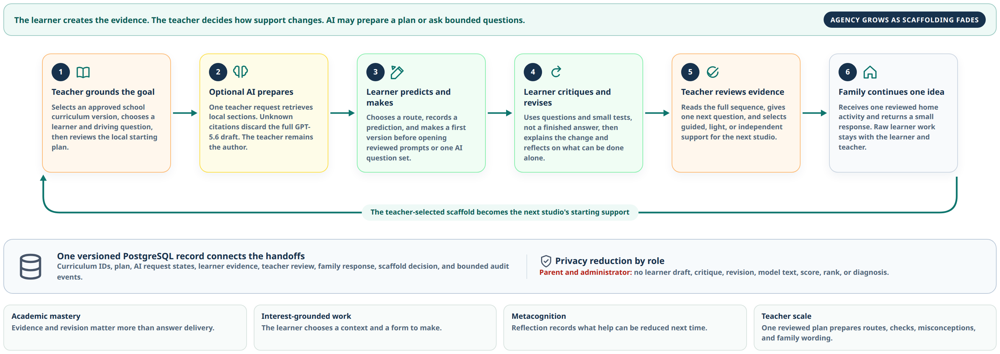
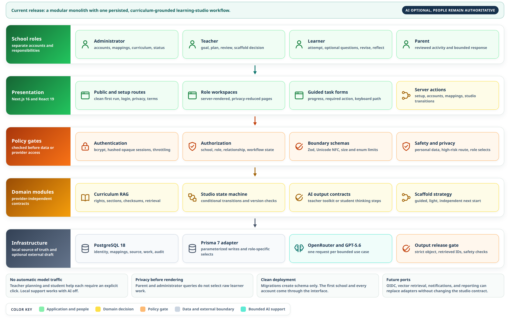

# Kanni system design

## 1. Product boundary

Kanni is a teacher-first learning platform for Classes 6 to 9. It connects four
roles around a curriculum-grounded learning studio:

```text
school maps responsibility
  -> teacher prepares and publishes
  -> learner predicts, makes, critiques, revises, explains, and reflects
  -> teacher reviews evidence and selects the next scaffold
  -> parent receives one reviewed activity and responds
```

The system does not grade, rank, diagnose, select an academic stream, recommend a
career, or let AI publish content.



## 2. Architecture choice

The current release is a modular monolith. Next.js holds the web interface and
server actions. PostgreSQL holds identity, mappings, workflow state, curriculum,
and audit records. OpenRouter is an optional adapter used for one teacher-requested
planning draft and one student-requested thinking coach per studio.

This shape is deliberate. A distributed system would add network failure,
deployment work, and privacy boundaries without helping the current workload.
The modules keep future integration points clear without pretending that separate
services already exist.

```text
Presentation
  app/ and components/
        |
Application actions
  app/actions/setup.ts
  app/actions/admin.ts
  app/actions/studio.ts
        |
Domain contracts and policy
  lib/studio/
  lib/curriculum/
  lib/safety/
  lib/permissions.ts
        |
Infrastructure adapters
  lib/db.ts -> Prisma -> PostgreSQL
  lib/ai/studio-ai.ts -> OpenRouter -> GPT-5.6
```

Dependencies point inward. The studio contract does not import OpenRouter. The AI
adapter may return only a validated `TeacherPlan` or `StudentThinkingCoach`.



## 3. Main modules

### Identity and installation

`app/actions/setup.ts` creates the only school and first administrator inside a
serializable transaction protected by a PostgreSQL advisory lock. The database
begins empty. `app/actions/admin.ts` creates later role accounts and responsibility
mappings.

`lib/auth.ts` owns password login, throttling, opaque sessions, cookie settings,
role homes, and actor resolution. Protected pages call `requireActor` for one
role. Application actions repeat school and relationship checks before writing.

### Curriculum and retrieval

`lib/curriculum/rag.ts` owns:

- rights basis validation
- source normalization to Unicode NFC
- deterministic section creation
- SHA-256 checksums
- small-pack lexical retrieval
- source context formatting
- citation allowlists

An administrator manages active and archived immutable curriculum versions. A
teacher can reuse an active pack or add a permission-safe teacher version. Small
packs do not need a vector database. The retrieval contract can later be implemented by an embedding
index without changing the teacher plan, learner submission, or workflow models.

### Learning studio

`lib/studio/contracts.ts` is the domain boundary. The main records are:

- `TeacherPlan`
- `CreateStudioInput`
- `CurriculumPackInput`
- `StudentThinkingCoach`
- `LearnerSubmission`
- `TeacherReviewInput`
- `FamilyResponseInput`

`lib/studio/plan.ts` creates a complete local starting plan. It keeps the product
usable with AI disabled. `lib/studio/grounding.ts` walks a plan and rejects nested
source IDs that are not in the retrieved section set. `lib/studio/workflow.ts`
contains status progress, prompt fading, and next-scaffold policy.

### AI and context adapter

`lib/ai/capability-policy.ts` decides whether runtime AI is available. It checks
the enable flag, provider, allowlisted model, provider key, and release-control
confirmations. Student AI adds a separate feature flag and a separate operator
confirmation for student-data processing, so enabling teacher planning cannot
silently enable student requests.

`lib/ai/prompt-context.ts` owns separate, versioned teacher and student
instructions and context builders. `lib/ai/studio-ai.ts` makes one bounded
OpenRouter request for the chosen use case, validates the structured result and
every citation, and returns a result category. It does not own publishing,
submission, or database transitions.

### Safety and privacy

`lib/safety/input-guard.ts` screens user-entered text for personal data, high-risk
English and Malayalam phrases, prompt injection, and source override attempts.
Teacher observations also reject diagnostic wording.

`lib/school-data.ts` uses different Prisma select shapes for each role. Privacy is
therefore enforced before rendering:

| Role | Raw learner submission | Student AI help | Teacher review | Family response | AI usage |
| --- | --- | --- | --- | --- | --- |
| Student | Own only | Own only | Own feedback only | No | No |
| Teacher | Assigned learner only | Assigned learner only | Full assigned record | Assigned handoff | Own aggregate |
| Parent | No | No | Reviewed summary only | Own handoff | No |
| Administrator | No | No | No raw feedback | No note body | School aggregate |

## 4. Patterns used with restraint

The code uses patterns where they clarify a real change boundary. It does not add
classes or interfaces only to name a pattern.

### State pattern, represented by persisted status

`LearningStudio.status` controls which action is valid and which role acts next.
The database update includes the expected status and version. This gives the main
benefit of the State pattern while keeping transitions explicit in server actions.

```text
planning
  -> ready_for_student
  -> awaiting_teacher_review
  -> ready_for_family
  -> complete
```

### Strategy pattern for scaffolding

`promptsForScaffold` applies one of three support policies to the same reviewed
prompt bank:

- `guided`: up to three prompts
- `light`: one prompt
- `independent`: no planned prompt at the start

Adding another scaffold policy changes one domain module. It does not change the
student submission contract.

### Adapter pattern for model providers

The OpenRouter code translates the provider API into `GroundedPlanResult` or
`GroundedStudentHelpResult`. Application actions depend on those results, not
provider response fields. A later school-hosted model can implement the same
boundaries.

### Factory function for safe local plans

`createTeacherStarterPlan` creates a valid `TeacherPlan` from a goal and local
sections. The factory preserves schema and citation invariants and gives the
teacher a useful plan without external AI.

### Facade by role

`getAdminWorkspace`, `getTeacherWorkspace`, `getStudentStudio`, and
`getParentStudio` present small role-specific views over the relational model.
They keep UI code away from cross-role joins and reduce the chance of selecting a
private field into the wrong page.

### Validation pipeline

Input checks run in a fixed order: schema, normalization, personal data, high-risk
route, prompt injection when AI-bound, authorization, state transition, database
write. Provider output follows a separate pipeline: provider object, use-case Zod
schema, citation allowlist, safety gate, then teacher review or student display.

This resembles Chain of Responsibility, but the implementation remains a small
set of pure functions because the chain is fixed.

### Patterns intentionally deferred

- no event bus until notifications or integrations create a real consumer
- no generic repository wrapper over Prisma while one database implementation exists
- no microservices until independent scale or ownership requires them
- no vector database while curriculum packs fit in a small deterministic context
- no agent loop because each use case is one bounded structured call

## 5. Data model

### Identity and access

- `School`: installation tenant
- `User`: credential and profile
- `Membership`: one role inside the school
- `TeacherStudent`: assigned teaching responsibility
- `GuardianStudent`: assigned family responsibility
- `Session`: hashed opaque login session
- `LoginThrottle`: HMAC-keyed failed-login window
- `AuditEvent`: bounded security and workflow event

### Curriculum and work

- `CurriculumPack`: source registry, rights basis, version, checksum, active state
- `CurriculumSection`: ordered source section and checksum
- `LearningStudio`: goal, plan, status, scaffold, and role references
- `LearnerSubmission`: prediction through reflection
- `TeacherReview`: observation, feedback, next question, next scaffold
- `FamilyHandoff`: reviewed activity and family response
- `StudentHelp`: validated question-and-action response and source IDs
- `AiRun`: status, model, prompt version, latency, tokens, cost, citation IDs

Raw provider prompts and model reasoning are not persisted.

## 6. Important request sequences

### First-run setup

```text
browser -> setup action: school and administrator fields
setup action -> Zod: validate and normalize
setup action -> PostgreSQL: serializable transaction and advisory lock
PostgreSQL -> setup action: school, user, membership, audit event
setup action -> auth: create opaque session
setup action -> browser: administrator workspace
```

Concurrent first-run requests serialize on the database lock. The second request
sees the created school and cannot create another administrator.

### Administrator curates curriculum, then teacher publishes without AI

```text
administrator -> curriculum action: source, version, rights confirmation
curriculum action -> curriculum module: normalize, split, checksum
curriculum action -> PostgreSQL: immutable pack and sections
teacher -> studio action: learner, goal, active pack ID
studio action -> role mapping: verify assigned learner and parent
studio action -> local plan factory: valid cited TeacherPlan
studio action -> PostgreSQL: studio and audit event
teacher -> plan editor: review and edit
teacher -> publish action: source confirmation
publish action -> PostgreSQL: planning -> ready_for_student
```

### Optional AI plan

```text
teacher -> AI action: explicit click
AI action -> PostgreSQL: atomically claim the studio's one request
AI adapter -> retrieval: top local sections
AI adapter -> OpenRouter: bounded GPT-5.6 structured request
OpenRouter -> AI adapter: candidate TeacherPlan
AI adapter -> Zod and citation checks
AI action -> PostgreSQL: safe plan or unavailable/rejected status plus usage
teacher -> publish action: human review remains required
```

### Optional student thinking coach

```text
student -> local form: write a first attempt of at least 60 characters
adult -> local form: confirm adult testing or supervision for this request
student -> help action: explicit click with studio ID, first attempt, and confirmation
help action -> safety: reject personal data, high-risk text, or prompt injection
help action -> PostgreSQL: verify assignment and atomically claim one help request
AI adapter -> retrieval: top four relevant local sections
AI adapter -> OpenRouter: bounded GPT-5.6 structured request
OpenRouter -> AI adapter: candidate StudentThinkingCoach
AI adapter -> Zod, citation, safety, and no-answer agency checks
help action -> PostgreSQL: safe help and usage, or unavailable/rejected status
student -> local form: choose what to test, revise, and submit
```

### Learner and family loop

```text
learner -> submission action: choices and six evidence fields
submission action -> safety and state checks
submission action -> PostgreSQL: ready_for_student -> awaiting_teacher_review
teacher -> review action: observation, feedback, question, next scaffold, family text
review action -> PostgreSQL: awaiting_teacher_review -> ready_for_family
parent -> response action: bounded response and optional note
response action -> PostgreSQL: ready_for_family -> complete
next studio -> workflow policy: inherit teacher-selected scaffold
```

## 7. Failure behavior

| Failure | Behavior |
| --- | --- |
| Empty installation race | One request wins the database lock; later setup is refused |
| Wrong role or school | Redirect or reject before data access |
| Missing support-circle mapping | Studio cannot be published |
| Stale workflow action | Conditional update fails and the record does not advance |
| Personal data in learner text | Text is not saved; learner is asked to remove it |
| High-risk text | Text is not saved; reviewed static support appears |
| AI disabled or missing key | Local teacher plan and reviewed student prompts remain usable |
| Provider timeout or error | Generated text stays hidden; request status is recorded |
| Malformed AI object | Candidate is discarded |
| Unknown citation | Whole candidate response is discarded |
| Parent or administrator query | Raw submission is absent from the database select |

## 8. Deployment topology

The production Compose stack has three runtime responsibilities:

```text
host browser
  -> 127.0.0.1:APP_PORT
  -> Next.js runner container
       -> internal data network
       -> PostgreSQL

migrator container
  -> internal data network
  -> PostgreSQL

Next.js runner, explicit teacher or student request only
  -> outbound HTTPS
  -> OpenRouter
```

The database is not published by the production Compose file. The runner and
migrator drop capabilities, reject privilege escalation, use read-only filesystems,
and receive a bounded temporary filesystem. A production operator still needs TLS,
an ingress proxy, rate limiting, managed secrets, monitoring, and tested backups.

## 9. Future integration path

### Curriculum at school scale

Introduce a `CurriculumRepository` port with two implementations:

1. current PostgreSQL section retrieval for small teacher packs;
2. an embedding-backed implementation for permission-cleared school collections.

Keep rights, version, checksum, and citation IDs in PostgreSQL. Store only the
embedding index needed for retrieval. A vector hit is never permission evidence.

### School identity

Add an identity adapter for OIDC or SAML. Map the external subject to `User` and
`Membership`. Keep relationship authorization inside Kanni so an identity token
alone cannot grant learner access.

### Notifications

Add an outbox table in the same transaction as a state transition. A separate
worker can send email, SMS, or school-system events idempotently. Do not call a
notification provider inside the workflow transaction.

### Reporting

Build reports from privacy-reduced event projections, not raw submissions. Add
school retention rules before any warehouse export.

### Multiple schools

Move from one-school installation setup to operator-managed school provisioning.
Keep `schoolId` on every tenant record, add tenant-aware database tests, and
consider database row-level security as a second boundary after application checks.

### Voice and accessibility

Add speech only behind a separate consent and data-processing review. For younger
learners, stream the minimum audio needed, avoid retaining raw recordings by
default, and keep a text and keyboard path for every activity.

## 10. Release qualities

- 360-pixel mobile layout and 200 percent zoom as design constraints
- keyboard completion for the main loop
- reduced-motion behavior
- visible focus and non-color status cues
- fixed English and Malayalam interface copy
- deterministic tests that make no provider calls
- a live AI test that requires explicit paid-run confirmation
- clean migrations from an empty database
- no seed or sample accounts in deployment

This design supports a serious school pilot path while staying honest about the
current release: one installation, Classes 6 to 9, school-managed text sources, and no
claim of educational effectiveness.
