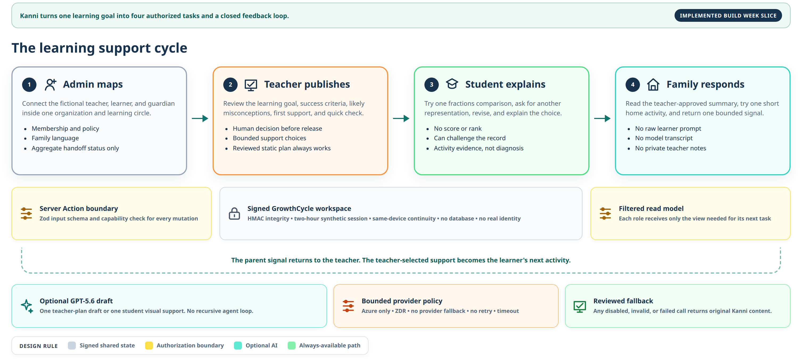
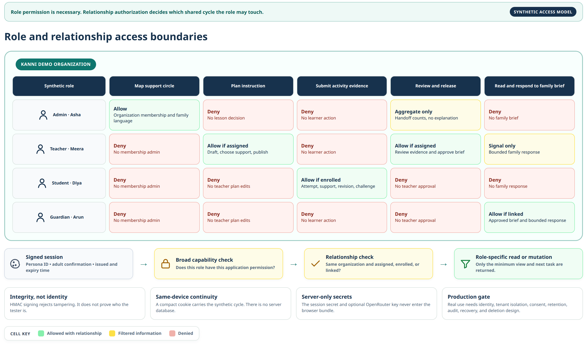
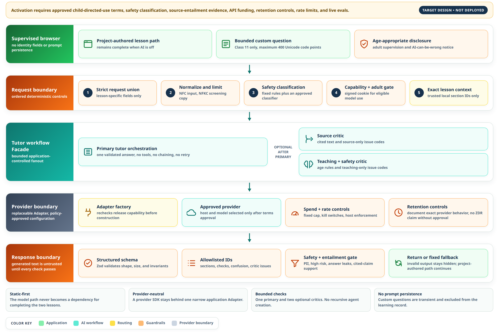

# Kanni system design

Last updated: July 17, 2026

## Decision summary

Kanni is an adult-operated, same-device concept demo for one connected learning-support cycle. A synthetic admin maps the support circle, a teacher publishes a fractions plan, a student attempts and explains, the teacher approves a family brief, and a linked parent returns one bounded signal. Each role sees a different authorized view of the same signed workspace.

The complete cycle works with original Kanni content. Optional OpenRouter integration can draft a structured teacher plan or one visual student support when an adult operator explicitly enables it. The path is disabled by default, limited to one configured model and provider route, and always falls back to reviewed content. It is not a recursive agent system.

Codex credits and API credits are different products. The approved $100 Codex credit can fund work done inside Codex. It cannot pay for model calls made by the Kanni application.

## Scope

Implemented judge path:

- four fixed synthetic personas: organization admin, teacher, student, and guardian
- signed two-hour synthetic sessions and a signed same-device `GrowthCycle`
- role capability checks plus organization and relationship authorization
- admin mapping and an aggregate handoff view
- teacher planning, support choice, publishing, evidence review, and family-brief approval
- student attempt, visual support, revision, explanation, and record-challenge control
- filtered English or Malayalam-preview parent activity and bounded response
- optional structured GPT-5.6 Sol drafting through OpenRouter, off by default
- deterministic project-authored fallback for every essential task
- retained Class 1 addition and Class 11 linear-search examples as secondary routes

Not implemented:

- real registration, passwords, identity proof, SSO, or account recovery
- a database or school information system
- real learner profiles
- multi-tenant provisioning, audit log, consent ledger, or deletion workflow
- curriculum ingestion
- analytics
- file search, web search, vector search, or model tools
- a production-approved model and hosting setup for real learners
- proof of learning improvement

## Current four-role release



```text
Synthetic login
  |
  v
Signed session cookie
  |
  +-- role capability check
  +-- organization and relationship check
  |
  v
Role portal and Server Action
  |
  v
Signed GrowthCycle cookie
  |
  +-- project-authored plan and support by default
  +-- optional bounded OpenRouter draft when explicitly configured
```

The browser is an untrusted boundary. HMAC signatures let the server reject changed session and workspace values, but the synthetic login is not identity proof. The workspace is continuity for a judge-operated demo, not a production student record.

## Role access boundary



```text
Signed session
  -> broad role capability
  -> same organization
  -> assigned, enrolled, or linked relationship
  -> minimum authorized read or mutation
```

Admin does not inherit teacher, learner, or guardian permissions. Teacher access requires assignment to the synthetic circle. Student access requires enrollment. Parent access requires an explicit guardian link and teacher approval of the family brief. The parent view contains no raw learner prompt, model transcript, score, rank, ability label, or private teacher note.

## Optional OpenRouter runtime

This path is implemented but disabled by default and has not been live-evaluated in the repository release evidence.



```text
Teacher or student Server Action
  -> synthetic adult session and relationship check
  -> fixed, rights-cleared Kanni fractions context
  -> OpenRouter AI SDK provider
  -> configured GPT-5.6 Sol model
  -> Azure-only and ZDR provider route
  -> structured Zod output
  -> signed workspace update

Any disabled flag, missing key, timeout, provider error, or invalid object
  -> reviewed project-authored content
```

Before this path can be enabled outside local adult judging:

1. Review the intended host and model provider terms for child-directed use.
2. Obtain the right OpenRouter account, route, retention controls, and separate API budget. Codex credits are not sufficient.
3. Add deployment rate limits, concurrency controls, and a fixed provider spend cap. Only then set the two production confirmation variables that unlock capability construction.
4. Run live structured-output, billing, rate-limit, timeout, invalid-output, and route-selection evals.
5. Complete adult teacher, parent, recent-learner, and native Malayalam review.
6. Publish model, prompt, content, provider-route, and test versions with known failures.

## Server boundaries

| Boundary | Current behavior | Future condition |
|---|---|---|
| Synthetic `/login` | Requires one fictional profile and adult confirmation, then sets a signed two-hour session. | Replace with reviewed identity, tenant, consent, and recovery design. |
| Portal Server Actions | Validate form data and enforce role plus relationship authorization before changing the signed cycle. | Persist through an audited tenant-isolated service only after a separate production design. |
| `GET /api/health` | Reports legacy tutor and GrowthCycle AI capability. It does not call a model or return a secret. | Keep as a non-sensitive readiness source. |
| `POST /api/adult-gate` | Returns unavailable while no provider is approved. | On approval, set a short-lived, signed, HttpOnly, SameSite cookie after explicit adult confirmation. |
| `POST /api/tutor` | Parses a strict request and returns fixed safety or off-topic responses before the adult gate. Other eligible requests require a valid adult cookie, then return unavailable while capability is off. It cannot call a model in this release. | Call the selected adapter only after capability, adult, privacy, lesson, safety, rate, and spend checks pass. |

Every API route is public. Request validation is not authentication. Rate limits and budget controls must exist at the hosting boundary before live AI is released.

## Future change map

The current design keeps only the seams that have a known reason to change.

| Likely change | Stable Kanni contract | Replaceable part |
|---|---|---|
| Model provider or SDK | `TutorModelAdapter` input and output types | provider adapter and server-only credentials |
| Teacher's Class 1 method | learner activity state and fixed-answer flow | one trusted Strategy entry |
| Safety phrase coverage | route result: generate, unsupported, or fixed safety redirect | ordered rule list and regression cases |
| Lesson version | stable lesson ID and section-ID validation | versioned, rights-cleared lesson pack |
| Hosting platform | public API contract and capability response | host configuration, rate limits, secrets, and logs |
| Same-device to approved multi-device use | versioned `LearningRecord` schema | storage adapter, identity, consent, retention, and access policy |

The last row is not a simple database task. It requires a separate product and privacy decision. A school pilot would need real authentication, tenant separation, role checks, consent records, retention limits, access logs, deletion handling, and incident ownership before a server record is added.

## Integration stages

### Stage 0: current concept demo

- four synthetic profiles only
- signed synthetic session and same-device cycle
- role and relationship checks
- project-authored fractions plan and support
- optional OpenRouter provider disabled by default
- no analytics

### Stage 1: reviewed adult-operated AI demo

- reviewed host and OpenRouter provider route
- separate API account, $10 test ceiling, and provider spend cap
- adult-only operation and retention notice
- server-side rate limits
- deployed safety and model evals
- provider version and prompt version published
- fixed lesson fallback kept as the default recovery path

### Stage 2: independently reviewed content expansion

- one new lesson at a time
- rights registry entry before content can be ingested
- immutable content version and checksum
- teacher and language review recorded separately
- new lesson-specific eval cases and browser path
- no claim of full curriculum coverage based on a few lessons

### Stage 3: approved multi-device pilot

- separate architecture and privacy review
- authentication and role authorization
- minimum data fields with a deletion and retention policy
- tenant isolation and access audit
- parent and teacher access tested with synthetic records first
- no raw learner prompt or transcript in teacher and parent views

Kanni does not need a vector database merely because lesson count grows. Add retrieval only when a measured content-size or selection problem exists, rights metadata travels with every chunk, and retrieval quality has its own eval set.

## Operational targets for a future model path

These are release conditions, not current service-level claims.

| Concern | Target behavior |
|---|---|
| Availability | Fixed lessons remain usable during provider, budget, rate-limit, or network failure. |
| Latency | Each GrowthCycle call stops at 18 seconds. There is no automatic application retry. |
| Cost | At most one call per explicit draft or support action. Essential role work never requires the call. |
| Privacy | Fixed prompt and original lesson context only. No synthetic name, answer, family response, workspace token, or secret in the model request or application logs. |
| Traceability | Record release, prompt, content, and model versions with a non-sensitive request correlation ID. |
| Safety | Input and output screens fail closed. High-risk cards never depend on a provider. |
| Change control | A model, prompt, content, safety-rule, or provider change reruns the affected eval and updates public evidence. |

If telemetry is added later, it needs its own notice and data review. The Build Week release has no analytics.

## Design-pattern decisions

Patterns are used for specific change points. Kanni does not add a pattern only to make the design look formal.

### State transitions: connected GrowthCycle

`lib/growth-cycle.ts` keeps every valid domain transition in one testable module. Mapping, publishing, attempting, using support, revising, reviewing, and responding each enforce their prerequisites.

Why explicit transitions fit: the order is part of the product promise, and impossible handoffs should fail before state is signed.

### Strategy: retained Class 1 activity

`lib/math-activity-strategies.ts` uses data-driven Strategy selection to map each teacher choice to a trusted question, fixed options, a visual form, a project-authored hint, and a lesson-section ID. The teacher's choice changes behavior rather than only changing a label.

Why Strategy fits: the activity algorithm varies, but the learner flow stays the same.

Reference: [Strategy](https://refactoring.guru/design-patterns/strategy)

### Adapter: model provider

The retained tutor uses `lib/ai/model-adapter.ts`. The revised cycle has a smaller fixed OpenRouter integration in `lib/ai/growth-ai.ts`; its application contract is the Zod-validated plan or support object rather than provider text.

`lib/ai/adapter-factory.ts` is the production construction point. The tutor Facade has no injected-adapter parameter, and the factory repeats the capability check before returning an adapter, so callers cannot bypass the route-level provider block through the application API.

Why Adapter fits: provider SDKs and configuration differ, while Kanni needs one stable application contract.

Reference: [Adapter](https://refactoring.guru/design-patterns/adapter)

### Facade: tutor workflow

`lib/ai/runtime.ts` exposes one orchestration entry point. It asks the adapter for output, validates that output, and isolates optional critic failures.

Why Facade fits: routes should call one small application service instead of knowing model SDK details.

Reference: [Facade](https://refactoring.guru/design-patterns/facade)

### Functional Chain of Responsibility: prompt boundaries

`lib/safety.ts` runs ordered rules for high-risk content, personal data, prompt injection, cheating, disallowed advice, and lesson scope. The first matching rule chooses a fixed route.

Why this form fits: order matters, each rule has one purpose, and the list is easy to test without a class hierarchy.

Reference: [Chain of Responsibility](https://refactoring.guru/design-patterns/chain-of-responsibility)

### Patterns not added

- No repository abstraction. There is no database.
- No event bus. One browser context owns the small record.
- No general agent loop. Tutor and critic calls are fixed application-controlled steps.
- No service locator or dependency container. The single adapter factory is enough for the current construction path.
- No vector-store abstraction. Both lesson packs fit in trusted local content.

The pattern catalog is a vocabulary, not a checklist. See [Refactoring Guru's design-pattern overview](https://refactoring.guru/design-patterns).

## Failure behavior

| Failure | Current user-visible result | Future model path |
|---|---|---|
| AI disabled | Fixed lessons remain available. Custom AI is labelled off. | Same fallback. |
| Adult gate missing | No model request is allowed. | Return 401 for an otherwise eligible model request. |
| Invalid request or unknown guided ID | Return 400. | Same. |
| Request body exceeds 8 KiB | Return 413 before classification. | Same. |
| Personal data or off-topic request | Return a fixed boundary response. | Do not call a model. |
| High-risk phrase | Return a fixed safety card with 1098, 112, and 14416. | Do not ask a model to write crisis advice. |
| Provider refusal, timeout, billing error, or rate limit | Not reachable in the static release. | Hide generated text and return the fixed unavailable response. |
| Malformed output or invented source ID | Not reachable in the static release. | Discard it and return the fixed unavailable response. |
| One optional critic fails | Not reachable in the static release. | Keep the already validated primary answer and mark that critic unavailable. |
| Browser storage changed or corrupt | Reject invalid records and start a new synthetic record. | Do not treat the record as authenticated data. |
| Attempt history reaches 12 entries | Keep the latest 12 attempts and continue without throwing. | Same. |

## Content and rights boundary

Only original Kanni lesson content is bundled for model context. It is licensed under CC BY 4.0. Public textbook pages are references only.

The following pages may help a human locate public textbook and handbook listings, but Kanni does not ingest, copy, transcribe, screenshot, redraw, index, or redistribute their content:

- [SCERT Kerala textbook archive](https://textbooksarchives.scert.kerala.gov.in/login.php)
- [Arabic Edu Web handbook listing shared during planning](https://www.arabiceduweb.in/2024/06/1-3-new-text-books-2024.html)
- [Arabic Edu Web textbook listing shared during planning](https://www.arabiceduweb.in/2024/05/i-iii-v-vii-ix-new-text-books-2024.html)

Unknown rights always mean link-only. Kanni does not use SCERT logos and does not claim SCERT endorsement.

## Records of decisions

| ID | Decision | Reason | Revisit when |
|---|---|---|---|
| ADR-001 | Keep one signed same-device record, not a database. | It proves the connected product loop without collecting identities. | Real multi-device use is approved. |
| ADR-002 | Keep the release useful without AI. | Static content gives every main role a complete path. | Never. This remains the fallback. |
| ADR-003 | Use OpenRouter only as an optional adult-operated adapter and keep it off by default. | Codex credits are not API credits, provider review is incomplete, and essential product behavior must remain testable without spend. | Live provider and deployment gates pass. |
| ADR-004 | Use strict lesson-specific request variants. | Class 1 fixed choices and Class 11 custom questions have different allowed fields. | A new lesson mode is implemented. |
| ADR-005 | Use fixed critics, not a recursive agent system. | Cost, latency, and failure count stay bounded. | A measured need justifies another fixed check. |
| ADR-006 | Treat external textbook listings as link-only. | Public access does not establish reuse rights. | Written permission or a compatible license is recorded. |
| ADR-007 | Use role checks and relationship checks. | A role alone must not grant access to every learner or family. | Never. Production identity adds to this rule. |

## Source notes

- [Vercel Acceptable Use Policy](https://vercel.com/legal/acceptable-use-policy), including the AI Services restrictions updated April 21, 2026
- [Vercel AI Product Terms](https://vercel.com/legal/ai-product-terms), including separate end-user terms and privacy-policy requirements
- [OpenAI Under 18 API Guidance](https://developers.openai.com/api/docs/guides/safety-checks/under-18-api-guidance)
- [OpenAI data controls](https://developers.openai.com/api/docs/guides/your-data#data-retention-controls-for-abuse-monitoring)

See [SECURITY.md](../SECURITY.md) for the threat model and release controls.
